<!-- ╔══════════════════════════════════════════════════════════════════╗ -->
<!-- ║  CHITRARTH RAI — GitHub Profile README                         ║ -->
<!-- ╚══════════════════════════════════════════════════════════════════╝ -->

<div align="center">

<!-- BANNER — self-hosted in repo, zero external servers -->


<br/>

[](https://git.io/typing-svg)

<div align="center">

### 🔭 Currently working on
**Developing high-performance enterprise solutions at [Neophyte-ai](https://neophyte-ai.com/)**

</div>

<br/>

[](https://www.linkedin.com/in/chitrarth-rai-38a40917b/)
[](mailto:chitrarthrai10@gmail.com)
[](https://github.com/Chitrarthrai)
[](https://neophyte-ai.com/)

<br/>


</div>

---

## 💼 About Me

```typescript
const chitrarth: Developer = {
  role      : "Full Stack Engineer @ Neophyte-ai",
  education : "B.Tech Electronics & Telecommunication — IIIT Bhubaneswar 🎓",

  // What I actually build day-to-day
  expertise : [
    "Full Stack Web Applications (MERN / Next.js)",
    "REST APIs & Backend Systems (Node.js / Express)",
    "Responsive UIs with React + Tailwind",
    "Cloud Deployment & DevOps (Azure, Docker)",
    "HRMS, ERP & Business Platforms",
  ],

  projects  : ["NeoDisha 🧭", "NeoQCR 📷", "HRMS Platform 👥", "E-commerce MERN 🛒", "FinanceTask 💰"],
  funFact   : "I ship products first, optimise second 🚀",
  contact   : "chitrarthrai10@gmail.com 📫",
};
```

---

## 🏆 GitHub Trophies

<div align="center">
  
</div>

---

## 💻 Tech Stack

<div align="center">

### Languages


### Frontend


### Backend & APIs


### Databases


### Cloud, DevOps & Tools


</div>

---

## 📊 GitHub Stats

<div align="center">


&nbsp;&nbsp;


<br/><br/>


&nbsp;&nbsp;


</div>

---

## 📈 Contribution Activity

<div align="center">

[](https://github.com/chitrarthrai)

</div>

---

## 🐍 Snake Eating My Contributions

<div align="center">

<picture>
  <source media="(prefers-color-scheme: dark)"
          srcset="https://raw.githubusercontent.com/Chitrarthrai/Chitrarthrai/output/github-contribution-grid-snake-dark.svg"/>
  <source media="(prefers-color-scheme: light)"
          srcset="https://raw.githubusercontent.com/Chitrarthrai/Chitrarthrai/output/github-contribution-grid-snake.svg"/>
  
</picture>

</div>

---

## 🌟 Live Projects

<div align="center">

<a href="https://github.com/chitrarthrai/FinanceTask">
  
</a>
&nbsp;
<a href="https://github.com/chitrarthrai/Full-Stack-E-Commerce-Website-Using-MERN">
  
</a>

<br/><br/>

<a href="https://github.com/chitrarthrai/Predicting_Purchase_Behavior_Using_Support_Vector_Machines-SVM-">
  
</a>

</div>

---

## 📊 Project Progress

<div align="center">

| Project | Stack | Progress | Status |
|:--------|:-----:|:--------:|:------:|
| **FinanceTask** |   |  | 🟢 **Active** |
| **MERN E-Commerce** |   |  | ✅ **Complete** |
| **HRMS Platform** |   |  | 🟠 **Building** |

</div>

---

## ⚡ Recent Activity

<!--START_SECTION:activity-->
1. 🔨 Recent commits and activity will appear here automatically after the GitHub Action runs.
<!--END_SECTION:activity-->

---

## 🃏 Dev Joke of the Day

<div align="center">


</div>

---

## 🏅 Milestones

<div align="center">


</div>

---

## 📄 Resume

<div align="center">

[](https://github.com/Chitrarthrai/Chitrarthrai/blob/main/Chitrarth_Rai_Resume.pdf)

</div>

---

<div align="center">

### 💬 Let's Build Something Together

[](https://www.linkedin.com/in/chitrarth-rai-38a40917b/)
[](mailto:chitrarthrai10@gmail.com)

<br/>

```
🛠 "First, solve the problem. Then, write the code." – John Johnson
```

<br/>


</div>

